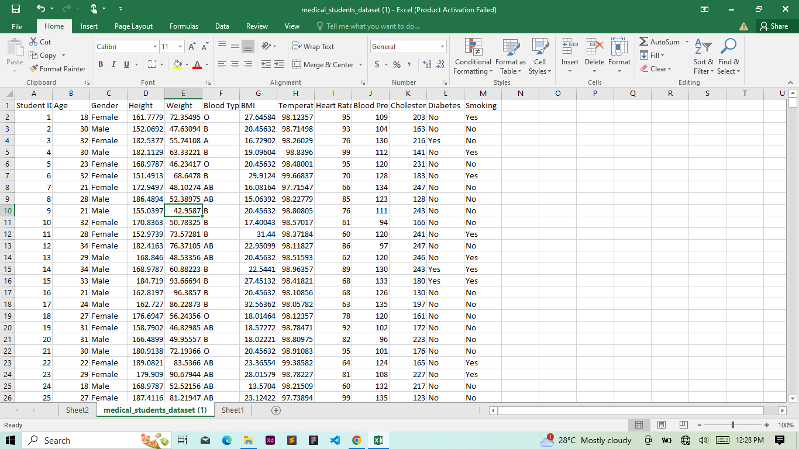
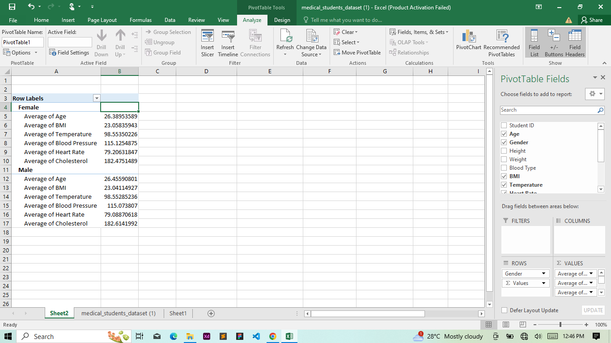
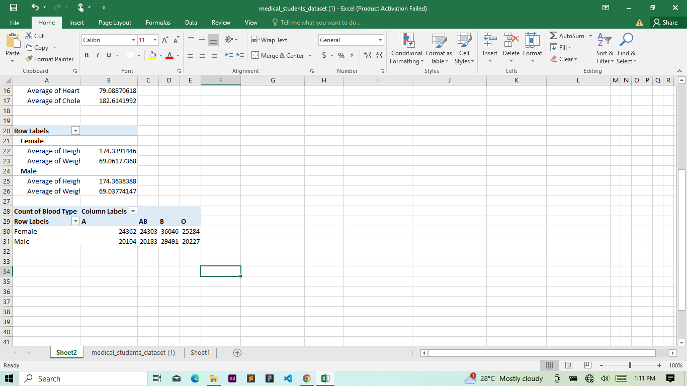
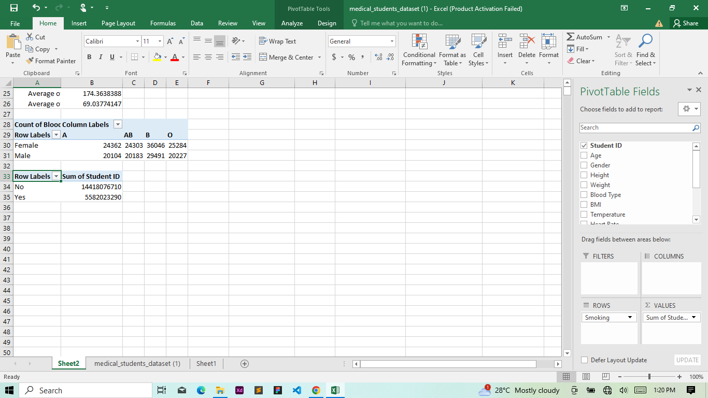
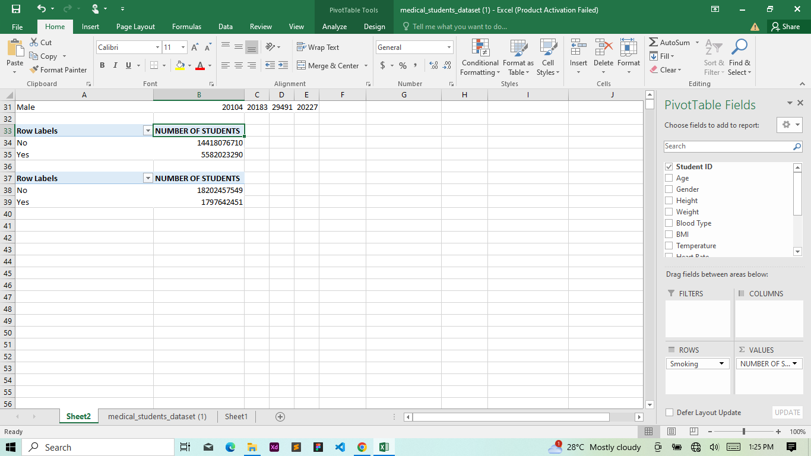

# STUDENT MEDICAL ANALYSIS

## Introduction

This is a task given to us by our tutor to use a given student medical dataset to create a pivot table aswering various questions 

# Activities
Using the medical student data,create pivot tale displaynig the following:

- Average values for the following for male and female(age,Bmi,temperature,heart rate,blood pressure,and cholesterol)
- Average height and weight for both gender(in 2 decimal places)
- Number of student across different blood groups
- Numer of students who smoke and those who dont
- Numer of students who have diabetes and those who dont

# Skill Demonstrated
1. Data Processing
2. Data Cleaning
3. Creating Pivot table

# Data Processing

The screenshot of the raw data which includes the students age,temperature,BMI,heart rate,weight,height,blood pressure and cholesterol was inputed to create a pivot table calculating the given prbolems as listed above

To process the data, i highlighted a cell and went to the insert header to insert the pivot table into a new sheet.Afterwards,each data was inserted into various rows,values and columns as seen below to calculate the average values for male  and female(age,Bmi,temperature,heart rate,blood pressure,and cholesterol)

After creating the pivot table for the first problem,i returned to the data file, then i highlighted a cell and went to the insert header where i inserted another pivot table in the existing sheet.Each data was niserted into row,values,amd column as seen below to solve the Average height and weight for both gender(in 2 decimal places).The same steps was repeated for all the other 3 problems stated above

# Conclusion
This was fun

